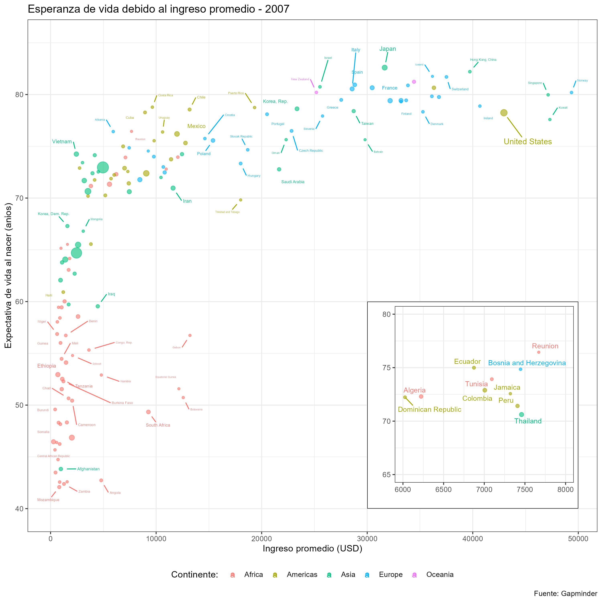

Utilice un documento tipo .Rmd o .qmd y genere un reporte html. Estos dos documentos (Rmd y html) guardelos con control de cambios en un repositorio de GitHub y **pegue solamente el enlace del repositorio** en esta entrega.

La entrega debe contener los códigos para obtener las siguientes figuras:


Réplica de la figura embebida



**Códigos**

Primer ejercicio

```{r}
data (mtcars)
mtcars$name = rownames(mtcars)
mtcars$cyl = as.factor(mtcars$cyl)

#Imagen A (barplot)
p1 = ggbarplot(mtcars, x = "name", y = "mpg", fill = "cyl", color = "white", palette = "jco", sort.val = "asc", sort.by.groups = TRUE, x.text.angle = 90) + font("x.text", size = 8)
```
